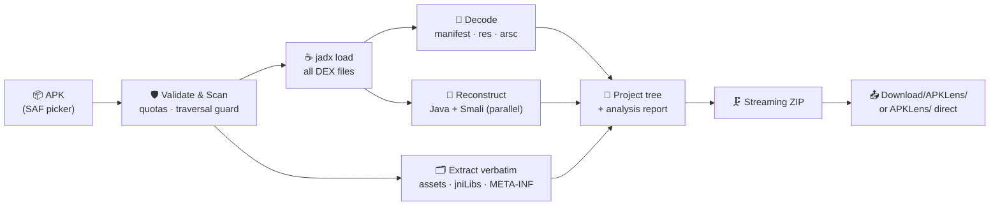

<div align="center">

<!-- ═══════════════════ ANIMATED BANNER ═══════════════════ -->


<!-- ═══════════════════ ANIMATED TAGLINE ═══════════════════ -->
<a href="#-features">
  
</a>

<!-- ═══════════════════ BADGES ═══════════════════ -->
<br/>


<!-- 🔁 Replace ModderTools / APKLens below with your repo path -->


<br/>


</div>

<!-- ═══════════════════════ LIVE DEMO ═══════════════════════ -->
## 🎬 See It In Action

<!-- 🔁 Record your own clips (see “Adding the demo GIFs” below) and save them at:
        docs/assets/home.gif        docs/assets/convert.gif        docs/assets/result.gif
     Until the files exist, this table shows broken-image placeholders on GitHub. -->
<div align="center">

<table>
<tr>
<td width="50%" align="center">
  <br/>
  <sub><b>Home</b> · dashboard · history · one-tap New Project</sub>
</td>
<td width="50%" align="center">
  <br/>
  <sub><b>Convert</b> · live pipeline stages · cancel anytime</sub>
</td>
</tr>
<tr>
<td width="50%" align="center">
  <br/>
  <sub><b>Result</b> · stats · share / open the ZIP</sub>
</td>
<td width="50%" align="center">
  <br/>
  <sub><b>Output</b> · an Android-project-shaped ZIP</sub>
</td>
</tr>
</table>

</div>

<!-- ═══════════════════════ ABOUT ═══════════════════════ -->
## 🔍 What Is ApkLens?

**ApkLens** is a JADX-style decompiler that runs **entirely on your Android phone**.
Pick any APK → it extracts every DEX file, reconstructs readable Java source, decodes
`resources.arsc` + `AndroidManifest.xml`, pulls out assets and native libraries, and hands
you back a clean, Android-project-shaped **ZIP** you can read, study, and share.

<div align="center">

> ⚠️ **Honest by design** — output is *reconstructed* code, not the original source.
> Comments, original formatting and local variable names are gone forever at compile time.
> ApkLens never pretends otherwise — every export ships with an `analysis-report.txt`
> that says exactly what was recovered, what wasn't, and why.

</div>

<br/>

<!-- ═══════════════════════ FEATURES ═══════════════════════ -->
## ✨ Features

| | Feature | Detail |
|:-:|---|---|
| ☕ | **DEX → Java** | `classes.dex`, `classes2.dex` … full multidex, powered by **jadx-core** |
| 📦 | **Project-shaped ZIP** | `AndroidManifest.xml`, `app/src/main/java/`, `res/`, `assets/`, `jniLibs/` — package hierarchy preserved |
| 🎨 | **Resource decoding** | Binary `resources.arsc` and AXML → readable XML (raw fallback when decoding fails) |
| 🧩 | **Everything else, verbatim** | `assets/`, native `.so` → `jniLibs/`, `META-INF/`, unknown files, optional raw DEX |
| 🧬 | **Smali fallback** | Exact, always-readable bytecode for every class — even ones decompilation chokes on |
| 🕵️ | **Kotlin detection** | Kotlin-origin classes flagged in the report (syntax stays Java — no fake `.kt` files) |
| 📈 | **Live pipeline UI** | Scan → Decode → Decompile → Build → ZIP, with progress, detail lines and cancel |
| 🗂 | **Project history** | JSON-backed log of every conversion with status, sizes and quick actions |
| 🎛 | **Tunable engine** | Threads, fallback mode, smali/raw-DEX/META-INF toggles — all in-app |
| 🛡 | **Hardened** | Zip-bomb quotas, path-traversal quarantine, per-class error isolation, temp cleanup |
| 📴 | **Fully offline** | **Zero** network permissions — nothing about your APKs ever leaves the device |
| ⚡ | **CI-built** | Gradle auto-fetches the official jadx engine; GitHub Actions produces installable APKs |

<br/>

<!-- ═══════════════════════ PIPELINE ═══════════════════════ -->
## ⚙️ How It Works



<br/>

<!-- ═══════════════════════ OUTPUT ═══════════════════════ -->
## 📁 What You Get

```text
MyProject/
├── AndroidManifest.xml          ← decoded, human-readable
├── analysis-report.txt          ← stats · Kotlin flags · warnings · failed classes
├── README.txt                   ← what this output is (and isn't)
├── app/src/main/
│   ├── java/com/example/app/    ← reconstructed .java (package tree preserved)
│   ├── res/                     ← decoded layouts · drawables · values …
│   ├── assets/                  ← verbatim
│   └── jniLibs/<abi>/*.so       ← verbatim native libraries
├── smali/                       ← exact bytecode (toggle in Settings)
├── META-INF/                    ← signing metadata (toggle in Settings)
└── apk/                         ← raw DEX + unknown files
```

<br/>

<!-- ═══════════════════════ STORAGE ═══════════════════════ -->
## 💾 Where the ZIP Goes

| Android | Destination | Notes |
|---|---|---|
| **8 – 9** | `/storage/emulated/0/APKLens/<Project>/<apk>.zip` | Exact path, storage permission requested at convert time |
| **10** | `/storage/emulated/0/APKLens/…` ✨ | Works via legacy-storage flag |
| **11+** | `Download/APKLens/<Project>/<apk>.zip` | No permission needed (MediaStore) |
| **11+ + All-Files grant** | `/storage/emulated/0/APKLens/…` ✨ | Optional — toggle from **Settings → Grant All-Files Access** |

<br/>

<!-- ═══════════════════════ BUILD ═══════════════════════ -->
<details>
<summary><b>🛠 Build From Source</b> <i>(click to expand)</i></summary>
<br/>

```bash
# Requirements: JDK 17 · Android SDK 34 · internet on first build (fetches the jadx engine)
git clone https://github.com/ModderTools/APKLens.git
cd APKLens

# Local build (or simply open in Android Studio and press Run)
gradle assembleDebug          # → app/build/outputs/apk/debug/

# Or let CI do it:
#   push → GitHub Actions → Artifacts → ApkLens-debug.apk
```

**Branding:**
- 🖼 Launcher icon → drop `logo.png` into `app/src/main/res/drawable/` (delete `logo.xml`)
- 👤 Developer page → edit `app/src/main/assets/developer.html`

</details>

<br/>

<!-- ═══════════════════════ LIMITS ═══════════════════════ -->
## 🚧 Realistic Limitations

<div align="center">

| ❌ Impossible (by physics of compilation) | ⚠️ Best-effort |
|---|---|
| Original comments & formatting | Obfuscated apps → readable but renamed code |
| Original local variable names | Heavily R8-optimized apps → partial structure |
| Original Java-vs-Kotlin syntax | Kotlin detection is a *flag*, not a rewrite |
| A ZIP that recompiles into the app | Packed/encrypted DEX → reported, not unpacked |

</div>

<br/>

<!-- ═══════════════════════ CREDITS ═══════════════════════ -->
## 🙏 Credits & License

| Project | Role | License |
|---|---|---|
| [jadx](https://github.com/skylot/jadx) | DEX decompilation & resource decoding engine | Apache-2.0 |
| **ApkLens** | On-device UI, pipeline, storage, export | © ApkLens developers |

Use responsibly: analyze apps you own or have permission to analyze, and respect copyright
and local law.

<br/>

<div align="center">


⭐ **Found it useful? Star the repo — it helps.** ⭐

</div>
